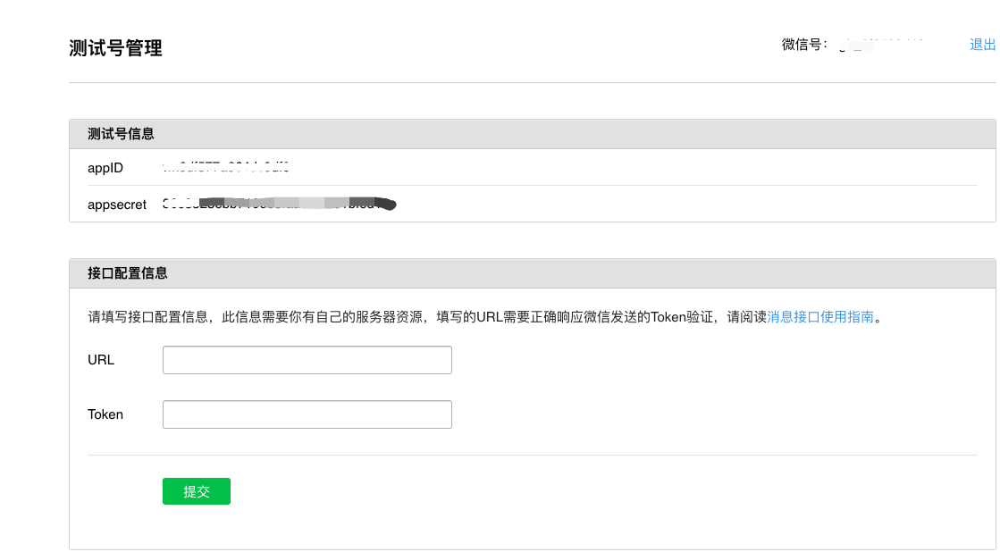
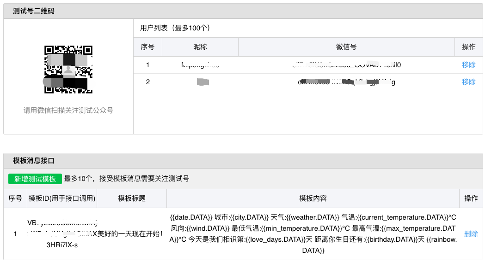
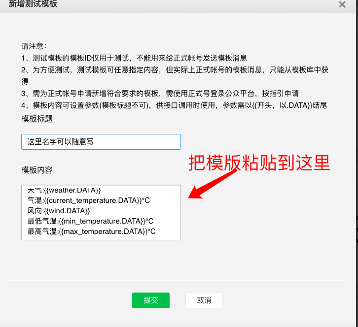
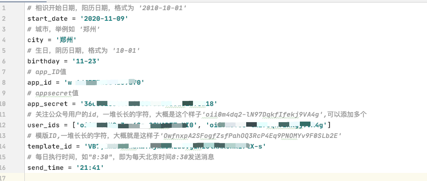

# test-morning
微信测试公众号推送

- 微信公众平台接口测试帐号申请：
http://mp.weixin.qq.com/debug/cgi-bin/sandbox?t=sandbox/login

- 微信扫描登陆后，界面如下：

1）登录进来appID,appSecret自动生成

2）扫描关注测试二维码，生成用户列表，列表中的微信号即为user_id。
需要谁接收消息就在user_id中填写对应的用户列表微信号

- 新增测试模版

- 测试模版复制下面的模版
~~~~
{{date.DATA}}
城市:{{city.DATA}} 
天气:{{weather.DATA}} 
气温:{{current_temperature.DATA}}℃ 
风向:{{wind.DATA}} 
最低气温:{{min_temperature.DATA}}℃ 
最高气温:{{max_temperature.DATA}}℃ 
今天是我们相识第:{{love_days.DATA}}天 
距离你生日还有:{{birthday.DATA}}天 
{{rainbow.DATA}}
~~~~
- git clone 代码到本地

git clone https://github.com/mapengchao03/test-morning.git

或者

git clone git@github.com:mapengchao03/test-morning.git
- config.py文件如下:

- config文件建在与main.py文件同级目录即可。参考如下：

~~~~
# 相识开始日期，阳历日期，格式为 '2010-10-01'
start_date = '2020-11-09'
# 城市，举例如 '郑州'
city = '郑州'
# 生日，阴历日期，格式为 '10-01'
birthday = '11-23'
# app_ID值
app_id = 'wx**********'
# appsecret值
app_secret = 'wx**********'
# 关注公众号用户的id，一堆长长的字符，大概是这个样子'oii0m4dq2-lN97DqkfIfekj9VA4g',可以添加多个
user_ids = ['wx**********', 'tx**********']
# 模版ID,一堆长长的字符，大概就是这样子'OwfnxpA2SFogfZsfPahOQ3RcP4Eq9PNOMYv9F0SLb2E'
template_id = 'wx**********'
# 每日执行时间，如"8:30"，即为每天北京时间8:30发送消息
send_time = '21:41'
~~~~

